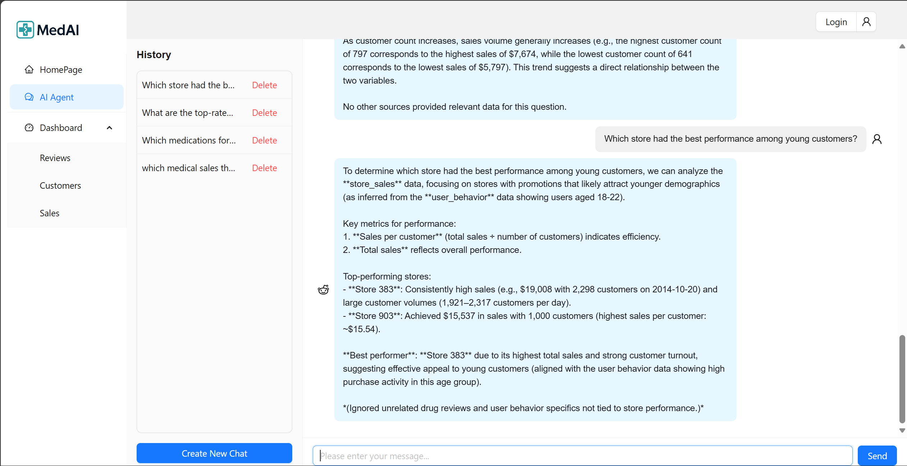

# ARIN7102-MedAI_platform

## 🧠 Project Overview

**ARIN7102-MedAI_platform** is a web-based interactive chatbot for intelligent medication sales support. Users can ask drug-related questions through the web interface, and the system retrieves and synthesizes relevant information to provide accurate and personalized suggestions.

The backend incorporates a **multi-agent semantic reasoning system**, where multiple specialized retrieval agents collaborate to supply the most relevant knowledge to a central large language model (LLM) for final answer generation.


## 🚀 Main Features

- 💬 **Conversational Medication Sales Assistant**  
  Intuitively answers complex questions related to medications, customer preferences, and usage behavior.

- 🤖 **Multi-Agent Knowledge Retrieval System**  
  Utilizes multiple FAISS-based agents—each representing a distinct dataset (e.g., drug reviews, customer behavior, store transactions)—to semantically retrieve relevant context. A central LLM synthesizes the final response based on all agent results.

- 🔍 **Vector-Based Semantic Search**  
  Supports retrieval over diverse data sources via sentence embedding and top-*k* similarity search.

- 🧠 **LLM-Driven Reasoning and Response**  
  The system avoids hard-coded routing logic by letting the LLM reason over retrieved multi-agent evidence, selectively using relevant data while ignoring noise.

- 🖥️ **Frontend-Backend Decoupled Architecture**  
  Built with a clean separation of concerns, enabling smooth integration between the Vue-based UI and the Python (Flask) backend with MySQL support.


## 🧩 System Workflow

1. **User Input**: A natural language question is submitted via the frontend.
2. **Agent Activation**: All FAISS agents independently perform semantic retrieval from their respective data domains.
3. **Context Aggregation**: Retrieved results are grouped and formatted with source tags.
4. **LLM Response**: A unified prompt is constructed and passed to a large language model, which generates a grounded, human-readable answer.


## 🛠 Tech Stack

- **Frontend**: Vue 3
- **Backend**: Flask
- **Database**: MySQL

---

## 📁 Database Schema

### `conversation` Table

| Field        | Type     | Null | Key | Extra          |
| ------------ | -------- | ---- | --- | -------------- |
| id           | int      | NO   | PRI | auto_increment |
| created_at   | datetime | YES  |     |                |
| last_updated | datetime | YES  |     |                |

### `message` Table

| Field           | Type | Null | Key | Extra          |
| --------------- | ---- | ---- | --- | -------------- |
| id              | int  | NO   | PRI | auto_increment |
| conversation_id | int  | NO   | MUL |                |
| question        | text | NO   |     |                |
| answer          | text | NO   |     |                |

---

## 🧪 How to Run the Project Locally

### 1. Database Setup

- Create a database named `aiask`
- Create the following two tables using the schema above: `conversation` and `message`

### 2. Backend Setup

- Navigate to the backend folder:
  ```bash
  cd backend
  ```

- Install required Python packages:
  ```bash
  pip install flask flask-cors flask-sqlalchemy openai
  ```

- Run the backend server:
  ```bash
  python app.py
  ```

### 3. Frontend Setup

- Navigate to the frontend project folder:
  ```bash
  cd user-center-frontend-vue-master
  ```

- Install dependencies and run:
  ```bash
  npm install
  npm run serve
  ```

---

## 📷 Demo Screenshots



---